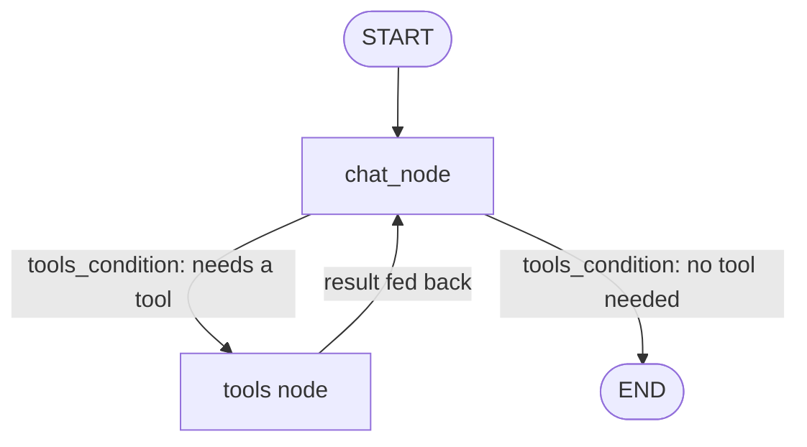

# 🧠 Agentic Multi-Tool Assistant

**An LLM agent that decides *for itself* which tool to reach for — live stock data, live web search, or a calculator — instead of a hardcoded if/else chain or a single static prompt.**

Built with **LangGraph**, served through a **Streamlit** interface.

---

## Why this isn't just "another chatbot wrapper"

Most beginner LLM projects fake "intelligence" with brittle keyword matching:

```python
if "stock" in query: call_stock_api()
elif "calculate" in query: call_calculator()
else: call_llm()
```

That approach breaks the moment a query doesn't match the expected phrasing. This project instead gives the LLM a **set of tools and lets it reason about which one (if any) the query needs**, how many times to call it, and how to chain results — the same tool-use pattern that powers production agent systems, not a toy demo.

The graph is stateful, so the agent can:
- Call zero, one, or multiple tools per turn
- Chain a tool result into a follow-up tool call before answering
- Fall back to its own reasoning when no tool applies
- Maintain conversation context across turns

---

## Architecture



The graph has exactly two nodes — `chat_node` (the LLM) and `tools` (a single node bound to all three tools) — connected in a loop via LangGraph's `tools_condition`: the LLM decides on a tool call → the `tools` node executes the right one → the result feeds back into the LLM's context → the LLM decides if it needs another tool or is ready to answer. This is a classic **ReAct-style agent loop**, implemented as an explicit LangGraph state machine rather than a black-box chain.

---

## Tools available to the agent

| Tool | Purpose | Trigger example |
|---|---|---|
| 📈 **Stock Data** | Fetches real-time price/quote data | *"What's Tesla trading at right now?"* |
| 🔍 **Web Search** | Pulls current, real-world information the model wasn't trained on | *"What's the latest news on the Fed rate decision?"* |
| 🧮 **Calculator** | Executes precise arithmetic instead of letting the LLM guess at math | *"What's 18% compound interest on $12,000 over 5 years?"* |

The agent decides tool selection **autonomously**, based on the semantics of the query — not keyword triggers.

---

## Tech Stack

- **LangGraph** — agent orchestration, state management, conditional routing
- **LangChain** — tool definitions & LLM integration
- **Streamlit** — chat interface with streaming responses
- **Python** — core implementation

---

## Project Structure

```
├── stock_chatbot_backend.py    # LangGraph agent: state graph, tool definitions, routing logic
├── stock_chatbot_frontend.py   # Streamlit chat interface
├── requirements.txt
├── .env.example
├── .gitignore
└── README.md
```

---

## Running it locally

```bash
git clone https://github.com/talhahashmi0305/Agentic-Multi-Tool-Assistant.git
cd langgraph-tool-agent
pip install -r requirements.txt
cp .env.example .env   # add your API keys
streamlit run stock_chatbot_frontend.py
```

---

## What this demonstrates

This project is a portfolio piece showing practical, production-oriented agent design:
- Stateful multi-step reasoning (not single-shot prompting)
- Autonomous tool selection over hardcoded routing logic
- Clean separation between orchestration (LangGraph), tools, and UI
- A pattern that scales to real client use cases — internal knowledge agents, research assistants, ops copilots — where "prompt and pray" isn't good enough.
